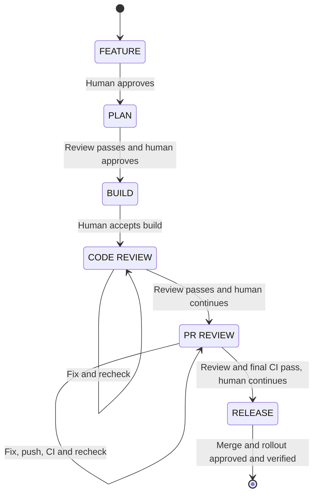

# Feature workflow

The `feature` skill keeps feature scope, progress and review evidence in the repository.
Use it when a change needs more than a short task or PR description.

Routine low-risk work can skip these artifacts unless a durable decision or contract is useful.

## Pipeline

The primary agent completes one phase per response and stops at its boundary.
`LGTM`, `continue` or `next` approves that result and enters only the next eligible phase.

A question or correction does not advance the flow.
A scope, plan, code or PR change reopens the earliest affected phase and its downstream gates.

## Human checkpoints

The human controls:

- Feature scope and important trade-offs
- The reviewed implementation plan
- Disputed medium findings and accepted risks
- Every branch, commit, push and PR action requested by the workflow
- Merge and release or rollout actions

The workflow names one exact next action before asking for approval.
Approval for a phase does not also approve a repository or external action.

## Artifacts

Each tracked feature uses `docs/features/YYYYMMDD-<slug>/`.

| File             | Purpose                                                          |
|------------------|------------------------------------------------------------------|
| `feature.md`     | Goal, context, scope, behavior, assumptions and contracts        |
| `plan.md`        | Approach, tasks, checks, gates, phase and current step           |
| `code-review.md` | Current code or PR review handoff, replies, rechecks and verdict |

Deferred work goes to `docs/features/backlog.md` with a stable `BL-NNN` ID.
Git and the PR keep history while feature artifacts keep current truth.

See [the artifact guide](references/artifacts.md) for the document formats.

## Review gates

| Gate | When it runs                                      | Main focus                               |
|------|---------------------------------------------------|------------------------------------------|
| Plan | After the plan is ready and before implementation | Scope, feasibility and complete coverage |
| Code | After implementation and local checks             | Behavior, contracts, tests and scope     |
| PR   | On the pushed PR head after required CI           | Integration and release readiness        |

Plan and code reviews can use standard or stress mode.
PR review always uses standard mode.

## Review modes

| Mode              | Reviewers                                | Use when                                                |
|-------------------|------------------------------------------|---------------------------------------------------------|
| Standard          | One general reviewer                     | Default for plan, code and PR gates                     |
| Stress            | General plus one named risk perspective  | A plan or code gate has a material risk                 |
| Focused follow-up | The reviewer for the open finding source | Rechecking open IDs, their fixes and caused regressions |

Stress review runs when the human requests it or one of these risks could cause a blocker or major issue:

- Security, privacy or authorization
- Data migration, corruption or loss
- Public API or compatibility
- Concurrency or distributed behavior
- Cross-cutting integration

Stress review does not run only because a change is large or unfamiliar.
It uses exactly two independent perspectives and the reviewers do not see each other's first result.

A stress PR request needs a human choice.
The options are a standard PR review or a stress code review on the PR diff followed by the standard PR gate.

See [the perspective guide](references/review-perspectives.md) for selection and combined verdict rules.

## Findings and verdicts

Reviews publish only findings with a verified trigger and concrete impact.

| Severity | Meaning                                                            |
|----------|--------------------------------------------------------------------|
| Blocker  | The change cannot be released safely                               |
| Major    | Required behavior is wrong or important proof is missing           |
| Medium   | A contained issue needs a clear disposition before handoff         |

Minor, style-only and low-value suggestions do not keep the review loop open.
Useful optional work can move to the backlog.

| Verdict                | Result                                                      |
|------------------------|-------------------------------------------------------------|
| `CHANGES NEEDED`       | A blocker or major finding remains open                     |
| `PASS WITH FOLLOW-UPS` | Only medium findings still need a disposition               |
| `PASS`                 | Required evidence is complete and no finding blocks handoff |
| `INCOMPLETE`           | Required evidence or a reviewer result is missing           |

The primary agent fixes accepted blocker, major and clear in-scope medium findings.
The human decides disputed medium findings, scope changes and accepted risks.

After an evidence-backed dispute of a blocker or major, the reviewer gets one focused recheck.
If it repeats the finding without answering the evidence or adding material evidence, the agent loop stops for a human decision.

## PR review handoff

PR preparation follows this order:

1. Close the feature artifacts
2. Resolve the intended source branch
3. Ask separately for a branch action when needed, commit, push and PR action
4. Wait for required CI
5. Review the pushed PR head while the review handoff and allowed plan state updates stay local

After a passing PR review, the workflow records the result in `plan.md` and asks separately to commit and push the final handoff.
It may include `code-review.md` and current lifecycle fields or review gate state in the same feature's `plan.md`.
The workflow checks the actual diff before applying this exception.
Changes to scope, tasks, verification or approval requirements still reopen review, including mixed changes in `plan.md`.
The allowed handoff changes keep the verdict, but final CI must pass before merge approval.

After final CI passes, the human approves `PR REVIEW` and enters `RELEASE`.
The workflow asks for merge approval only after that phase change.
Later lifecycle state updates may stay local until the next approved commit.
Any later push still needs final CI before merge.

The review target remains the implementation head that was checked.
It is not rewritten to the later handoff commit.

## Review configuration

Review model and effort settings apply only to a new independent review process.
They do not change the active development session.

Projects may override review settings in `.codex/feature-review.json` or `.claude/feature-review.json`.
See [the review agent guide](references/review-agents.md) for the current defaults, format and precedence.

## Detailed contracts

- [Feature skill instructions](SKILL.md)
- [Feature phases](references/phases.md)
- [Review perspectives](references/review-perspectives.md)

The `feature-review` skill owns the detailed gate and `code-review.md` handoff rules.
