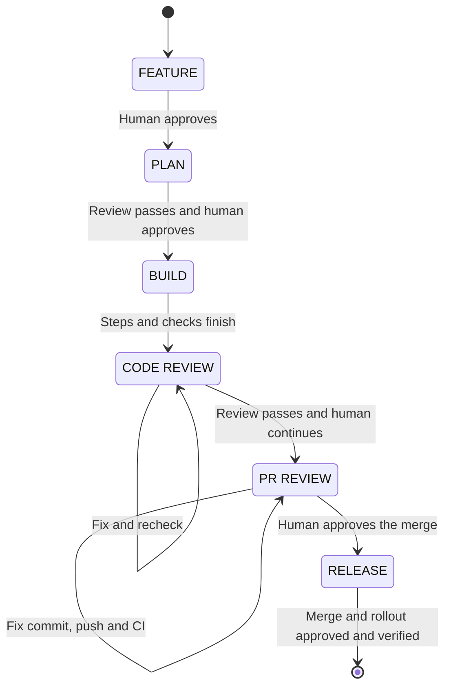

# Feature workflow

The `feature` skill keeps feature scope, progress and review evidence in the repository.
Use it when a change needs more than a short task or PR description.

Routine low-risk work can skip these artifacts unless a durable decision or contract is useful.

## Pipeline

```mermaid
stateDiagram-v2
    state "CODE REVIEW" as CODE_REVIEW
    state "PR REVIEW" as PR_REVIEW

    [*] --> FEATURE
    FEATURE --> PLAN: Human approves
    PLAN --> BUILD: Review passes and human approves
    BUILD --> CODE_REVIEW: Steps and checks finish
    CODE_REVIEW --> CODE_REVIEW: Fix and recheck
    CODE_REVIEW --> PR_REVIEW: Review passes and human continues
    PR_REVIEW --> PR_REVIEW: Fix commit, push and CI
    PR_REVIEW --> RELEASE: Human approves the merge
    RELEASE --> [*]: Merge and rollout approved and verified
```

The primary agent completes one phase per response and stops at its boundary.
Plan approval is the exception: the build runs straight into the code gate, and the next stop comes when that gate passes
or [needs the human](flow/approvals.md#run-the-build-and-the-code-gate-as-one-stretch).
`LGTM`, `continue` or `next` approves that result and enters only the next eligible phase.

A question or correction does not advance the flow.
Before the PR opens, a scope, plan or code change reopens the earliest affected phase and its downstream gates.

The files stop at the PR.
Their last update comes before the push: `Status: implemented` and a passed code gate.
After the PR opens, a fix is a normal commit pushed to the PR, and no file changes.

## Human checkpoints

The human controls:

- Feature scope and important trade-offs
- The reviewed implementation plan
- A finding dispute that one rebuttal and one recheck leave open, and accepted risks
- Every branch action other than the rewrite's backup branch, every push and PR action,
  and every commit that plan approval or entering `PR REVIEW` does not cover
- Signing every commit on the branch, after the history rewrite and before the push
- Merge and release or rollout actions

The workflow names one exact next action before asking for approval.
Approval for a phase does not also approve a repository or external action.
Two approvals are the exception, and each covers only local actions.
Plan approval covers the checkpoint commits of the build and of the code gate fixes.
Entering `PR REVIEW` covers the close-out checkpoint and [the history rewrite](flow/5-pr-review.md#rewrite-the-history).

## Team

| Role               | Does                                                 |
|--------------------|------------------------------------------------------|
| `architect`        | Drafts `feature.md` and `plan.md` and never approves |
| `developer`        | Implements one plan step inside its files            |
| `code-reviewer`    | Checks a step with check runs and mutation checks    |
| `qa`               | Raises coverage and triages findings                 |
| `technical-writer` | Brings the docs to the code and drafts the PR text   |

The primary agent leads the team: it briefs each role, verifies the result and commits.
It commits each accepted step and gate fix as an unsigned checkpoint, and plan approval covers those local commits.
Before the push, it rewrites the unpushed history into a few atomic commits and keeps a backup branch.
The human signs those commits.
See [the briefs](team/briefs.md), [the steps](team/steps.md) and [the team rules](team/rules.md).

## Artifacts

Each tracked feature uses `docs/features/YYYYMMDD-<slug>/`.

| File             | Purpose                                                    |
|------------------|------------------------------------------------------------|
| `feature.md`     | Goal, why, scope, how it works, criteria and decisions     |
| `plan.md`        | Done checks, steps, gates, phase and current step          |
| `code-review.md` | Current code review handoff, replies, rechecks and verdict |

Deferred work goes to `docs/features/backlog.md` with a stable `BL-NNN` ID.
Git and the PR keep history while feature artifacts keep current truth.

See [the writing style](writing/style.md) and [what may change after approval](flow/changes.md#after-approval).
Each file has [a template](templates/feature.md) and [a worked example](examples/feature.md).

## Review gates

| Review | When it runs                                      | Recorded in                 | Main focus                               |
|--------|---------------------------------------------------|-----------------------------|------------------------------------------|
| Plan   | After the plan is ready and before implementation | `plan.md`                   | Scope, feasibility and complete coverage |
| Code   | After implementation and local checks             | `plan.md`, `code-review.md` | Behavior, contracts, tests and scope     |
| PR     | On the pushed PR head, beside CI                  | PR comments, never a file   | Integration and release readiness        |

`plan.md` tracks two gates: plan review and code review.
The PR review runs on the PR itself.
Plan and code reviews can use standard mode or a risk review.
PR review always uses standard mode.

## Review modes

| Mode              | Reviewers                                | Use when                                                   |
|-------------------|------------------------------------------|------------------------------------------------------------|
| Standard          | One general reviewer                     | Default for the plan and code gates and the PR review      |
| Risk review       | General plus one named risk perspective  | A plan or code gate has a material risk                    |
| Focused follow-up | The reviewer for the open finding source | Rechecking open IDs, their fixes and caused regressions    |
| Challenge pass    | One independent read-only reviewer       | The human asks to attack the finished change before the PR |

A challenge pass runs only after a passing code gate and never changes its verdict.

A risk review runs when the human requests it or one of these risks could cause a blocker or major issue:

- Security, privacy or authorization
- Data migration, corruption or loss
- Public API or compatibility
- Concurrency or distributed behavior
- Cross-cutting integration

A risk review does not run only because a change is large or unfamiliar.
It uses exactly two independent perspectives and the reviewers do not see each other's first result.

A PR risk review request gets an explanation instead.
A risk review runs only at the plan and code gates, before the PR opens.

See [the risk review rules](review/risk-review.md) for selection and combined verdict rules.

## Findings and verdicts

Reviews publish only findings with a verified trigger and concrete impact.

| Severity | Meaning                                                            |
|----------|--------------------------------------------------------------------|
| Blocker  | The change cannot be released safely                               |
| Major    | Required behavior is wrong or important proof is missing           |
| Medium   | A contained issue needs a clear disposition before handoff         |

Minor, style-only and low-value suggestions do not keep the review loop open.
Useful optional work can move to the backlog.

| Verdict                | Result                                                      |
|------------------------|-------------------------------------------------------------|
| `CHANGES NEEDED`       | A blocker or major finding remains open                     |
| `PASS WITH FOLLOW-UPS` | Only medium findings still need a disposition               |
| `PASS`                 | Required evidence is complete and no finding blocks handoff |
| `INCOMPLETE`           | Required evidence or a reviewer result is missing           |

The primary agent fixes every finding it accepts, of any severity, inside the approved scope.
It gives each medium a disposition itself: fix, backlog or dispute.
The human decides scope changes and accepted risks.

After an evidence-backed dispute of a finding of any severity, the reviewer gets one focused recheck.
If it repeats the finding without answering the evidence or adding material evidence, the agent loop stops for a human decision.

## Review configuration

Review model and effort settings apply only to a new independent review process.
They do not change the active development session.

Projects may override review settings in `.codex/feature-review.json` or `.claude/feature-review.json`.
See [the review settings](review/settings.md) for the current defaults, format and precedence.

## Detailed contracts

- [Feature skill instructions](SKILL.md)
- Writing: [style](writing/style.md), [folder](writing/folder.md), [`feature.md`](writing/feature.md),
  [`plan.md`](writing/plan.md) and [`code-review.md`](writing/code-review.md)
- Flow: [1. feature](flow/1-feature.md), [2. plan](flow/2-plan.md), [3. build](flow/3-build.md),
  [4. code review](flow/4-code-review.md) and [5. PR review](flow/5-pr-review.md), then at any point
  [status](flow/status.md), [approvals](flow/approvals.md) and [changes](flow/changes.md)
- Team: [rules](team/rules.md), [briefs](team/briefs.md) and [steps](team/steps.md)
- Review: [1. prepare](review/1-prepare.md), [2. check](review/2-check.md), [3. findings](review/3-findings.md) and
  [4. report](review/4-report.md), then when needed [challenge pass](review/challenge.md),
  [risk review](review/risk-review.md) and [settings](review/settings.md)

The `review/` files own the detailed gate rules.
[`writing/code-review.md`](writing/code-review.md) owns the `code-review.md` rules.
